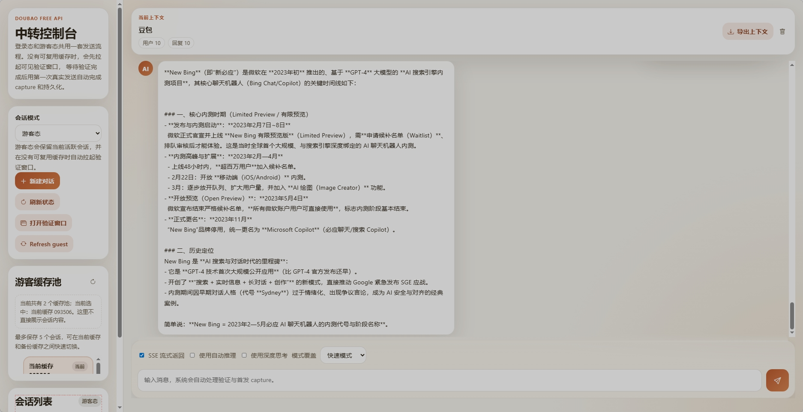

# CLI_Doubao

一个轻量级 API 工具链 与通用流程编排示例智能体臃肿实现。

<!-- PROJECT SHIELDS -->

[![Contributors][contributors-shield]][contributors-url]
[![Forks][forks-shield]][forks-url]
[![Stargazers][stars-shield]][stars-url]
[![Issues][issues-shield]][issues-url]
[![AGPL License][license-shield]][license-url]

<!-- PROJECT LOGO -->
<br />

<p align="center">
  <a href="https://github.com/db-nice/CLI_Doubao">
    
  </a>

  <h3 align="center">CLI_Doubao x Smali x Jadx</h3>
  <p align="center">
    通用逻辑框架示例 · 会话编排 · 运行时预热 · SSE 流式响应
    <br />
    仅供学习与参考，不提供任何不良用途引导
    <br />
    <br />
    <a href="#项目定位">项目定位</a>
    ·
    <a href="#快速开始">快速开始</a>
    ·
    <a href="#主要接口">主要接口</a>
    ·
    <a href="#合规说明">合规说明</a>
  </p>
</p>

<!-- 特别鸣谢 & 参考项目（HTML 富文本） -->
<div align="center">
  <h2>🙏 特别鸣谢 · 参考项目</h2>
  <p>感谢以下开源项目在架构思路、接口组织与工程实践方面提供的参考。</p>
  <table style="border-collapse: collapse; width: 80%; margin: 20px auto;">
    <tr>
      <td style="border: 1px solid #e1e4e8; padding: 20px; text-align: center; border-radius: 8px;">
        <a href="https://github.com/XilyFeAAAA/DoubaoFreeApi" target="_blank">
          <strong style="font-size: 1.2em;">📦 DoubaoFreeApi</strong>
        </a>
        <br />
        模板交互与流程组织参考
        <br />
        <span style="color: #586069;">为本项目提供了接口编排、运行链路和交互方式上的启发</span>
      </td>
      <td style="border: 1px solid #e1e4e8; padding: 20px; text-align: center; border-radius: 8px;">
        <a href="https://github.com/lzA6/doubao-2api" target="_blank">
          <strong style="font-size: 1.2em;">⚙️ doubao-2api</strong>
        </a>
        <br />
        自获取功能灵感来源
        <br />
        <span style="color: #586069;">借鉴其代理设计模式，优化服务稳定性</span>
      </td>
    </tr>
  </table>
  <p style="color: #6a737d;">本项目仅在学习与研究场景中参考其设计思路</p>
</div>

## 项目定位

本项目基于 FastAPI 构建，主要演示一个轻量级 API 服务在以下方面的组织方式：

- 路由聚合与请求分发
- 会话状态维护与上下文续接
- 浏览器辅助运行时预热
- 流式响应输出
- 简单 Web 控制台联动

仓库更适合作为工程学习样例、接口编排参考和 PoC 验证模板使用。这里展示的是一套通用逻辑框架写法，用于说明服务端如何组织会话、运行时状态与前端控制台之间的协作关系，不面向任何违规、滥用或不良用途。
如果本项目获得足够多的关注，并且有贡献者愿意一起维护，作者将考虑：
尝试 Android 版本：调用电脑侧服务，在手机端发起请求并接收返回结果
移动端环境支持：通过 BusyBox 容器限制工具链终端，支持命令行环境依赖安装
轻量化移植方案：Termux 轻量移植以及 QPython 等综合解决方案
模型微调计划：如有共同兴趣的技术大佬共同维护以及赞助算力，微调一份专用模型进行灰度测试
当前定位：项目目前处于概念验证阶段。

测试性质说明：本项目在任意一个具备高推理能力以及高质量数据集的模型上都可以运行，豆包仅作为测试平台使用。
技术研究背景：这里必须夸赞豆包的上下文理解能力以及风控机制做得相当出色，行为模式难以分析。作者熬着夜分析了好几天才得以实现。因此，不能保证完整性

## 核心能力

- 统一聊天入口：支持新建对话、续接对话与 SSE 流式响应。
- 运行时状态管理：支持运行环境检查、预热、手动验证和状态查询。
- 游客态缓存池：支持快照查看、重置与恢复，便于复用上下文。
- 会话查询能力：支持读取会话信息、拉取历史消息与删除会话。
- 前端控制台：提供一个简单的 Web 界面用于验证整体交互链路。

## 适用场景

- 学习 FastAPI 项目的分层结构与接口组织方式。
- 参考会话池、运行时状态与浏览器辅助流程的工程实现。
- 作为中间层服务或控制台 Demo 的基础模板进行二次开发。
- 用于接口调试、前后端联调和通用流程编排实验。

## 快速开始

### 环境要求

1. Python 3.11+
2. `pip` 或 `uv`
3. 可用的 Edge 浏览器环境

### 安装步骤

1. 克隆仓库

```sh
git clone https://github.com/db-nice/CLI_Doubao.git
cd CLI_Doubao
```

2. 安装依赖

```sh
python -m venv .venv
.venv\Scripts\Activate.ps1
pip install -r requirements.txt
```

如果你使用 `uv`，也可以改为：

```sh
uv venv
.venv\Scripts\Activate.ps1
uv pip install -r requirements.txt
```

3. 启动服务

```sh
python app.py
```

服务默认运行在 `http://localhost:8100`

- Web 控制台：`http://localhost:8100/`
- API 文档：`http://localhost:8100/docs`

## 项目结构

```text
CLI_Doubao
src
├─ api 〔接口路由总控〕
│  ├─ router.py 〔路由聚合注册〕
│  │  └─ 事件: 汇总注册 completions / conversations / file / runtime
│  └─ endpoints 〔按域分发事件〕
│     ├─ completions.py 〔发送续聊分流〕
│     │  └─ 事件:
│     │     POST /api/chat/completions
│     │     POST /api/chat/completions/stream
│     │     POST /api/chat/completions/new
│     │     POST /api/chat/completions/new/stream
│     │     POST /api/chat/completions/continue
│     │     POST /api/chat/completions/continue/stream
│     ├─ conversations.py 〔会话历史管理〕
│     │  └─ 事件:
│     │     POST /api/chat/delete
│     │     GET  /api/chat/conversation/info
│     │     GET  /api/chat/conversation/messages
│     ├─ file.py 〔文件上传桥接〕
│     │  └─ 事件:
│     │     POST /api/chat/upload
│     └─ runtime.py 〔运行验证编排〕
│        └─ 事件:
│           GET  /api/chat/runtime/status
│           POST /api/chat/runtime/bootstrap
│           POST /api/chat/runtime/guest/reset
│           GET  /api/chat/runtime/guest/snapshots
│           POST /api/chat/runtime/guest/restore
│           GET  /api/chat/runtime/browser-capture
│           POST /api/chat/session/refresh
│           POST/GET /api/chat/runtime/request-preview
│           POST /api/chat/runtime/request-preview/new
│           POST /api/chat/runtime/request-preview/continue
│           POST /api/chat/runtime/manual-verify/start
│           POST /api/chat/runtime/manual-verify/finish
│           POST /api/chat/runtime/manual-send
├─ model 〔协议模型定义〕
│  ├─ conversation_mode.py 〔新续模式判定〕
│  ├─ request.py 〔请求结构约束〕
│  ├─ response.py 〔响应结构约束〕
│  └─ session_mode.py 〔模式分流定义〕
├─ pool 〔会话池化存取〕
│  ├─ fetcher.py 〔浏览自动抓取〕
│  │  └─ 事件: DoubaoAutomator 拉取初始会话参数
│  └─ session_pool.py 〔会话缓存总池〕
│     └─ 事件:
│        load/save session
│        set/get session binding
│        guest snapshot list/backup/restore
│        conversation_state cache
│        pool_key / snapshot_id 归一
└─ service 〔业务编排核心〕
   ├─ browser_runtime.py 〔浏览验证调度〕
   │  └─ 事件:
   │     hidden/manual browser 启停
   │     page 跳转与验证窗口拉起
   │     capture / signer / cookie / storage_state 同步
   ├─ doubao_service.py 〔核心对话编排〕
   │  └─ 事件:
   │     请求拼装
   │     新建/续聊判定
   │     preview 预览
   │     manual verify / manual send
   │     SSE 解析
   │     conversation info/messages/delete
   │     guest capture 持久化
   ├─ guest_session_service.py 〔游客缓存轮转〕
   │  └─ 事件:
   │     list snapshots
   │     reset guest session
   │     restore snapshot
   │     rotate on limit
   ├─ runtime_bootstrap.py 〔启动预热桥接〕
   │  └─ 事件: snapshot -> runtime 预热
   └─ runtime_capture_service.py 〔捕获引导编排〕
      └─ 事件:
         capture ready 判定
         bootstrap message 生成
         runtime capture 启动

```

## 主要接口

当前路由入口挂载在 `/api` 下，实际使用时以 `/docs` 页面为准。当前主要能力包括：

### 对话生成

- `POST /api/chat/completions`
- `POST /api/chat/completions/stream`
- `POST /api/chat/completions/new`
- `POST /api/chat/completions/new/stream`
- `POST /api/chat/completions/continue`
- `POST /api/chat/completions/continue/stream`

### 会话管理

- `POST /api/chat/delete`
- `GET /api/chat/conversation/info`
- `GET /api/chat/conversation/messages`

### 运行时与游客态管理

- `GET /api/chat/runtime/status`
- `POST /api/chat/runtime/bootstrap`
- `POST /api/chat/runtime/guest/reset`
- `GET /api/chat/runtime/guest/snapshots`
- `POST /api/chat/runtime/guest/restore`
- `GET /api/chat/runtime/browser-capture`
- `POST /api/chat/session/refresh`
- `POST /api/chat/runtime/request-preview`
- `POST /api/chat/runtime/request-preview/new`
- `POST /api/chat/runtime/request-preview/continue`
- `POST /api/chat/runtime/manual-verify/start`
- `POST /api/chat/runtime/manual-verify/finish`
- `POST /api/chat/runtime/manual-send`

> 说明：`src/api/endpoints/file.py` 中保留了文件上传桥接能力的代码结构，是否启用以当前路由注册状态为准。

## 前端界面

当前前端控制台主要用于演示登录态、游客态、会话列表、运行时状态和消息发送链路。

<p align="center">
  
</p>

## 使用建议

- 将本项目视为通用流程框架与工程样例，而不是生产级正式服务。
- 二次开发时，优先复用 `api / model / pool / service` 的分层结构。
- 如果需要稳定商用或长期运行，请优先使用目标平台官方 API 或正式授权方案。

## 贡献指南

1. 提交 PR 前请确保基础功能可运行。
2. 新功能建议先创建 Issue 讨论设计方向。
3. 请保持接口说明、文档与实现同步更新。
4. 不提交与当前项目目标无关的大体量改动。
5. 如果出现奇怪问题项目作者修不懂(没开智下一步不知道怎么修了)
6.  建议摇人加入讨论的Q群: 417516743--> 说明意图 方便进行讨论交流 这是一个游戏群 单开群聊难受太尴尬 如果项目使用者/参与者多了会考虑单独开群 欢迎各路领域大佬/大神/猛新加入讨论交流 记得开免打扰

## 合规说明

1. 本项目仅供学习、研究与工程参考使用。
2. 本项目展示的是通用逻辑框架编写方式，不针对任何平台、服务或对象提供不良引导。
3. 仓库内容不构成任何绕过限制、规避风控、攻击服务、批量账户滥用的操作指南。
4. 使用者应自行遵守相关法律法规、平台协议、隐私政策与数据安全要求。
5. 若因不当使用造成账号、数据、服务或法律风险，责任由使用者自行承担。
6. 如需生产环境或商业场景接入，请优先选择官方 API 或已获授权的服务方案。

## 版权说明

该项目采用 AGPL v3.0 许可证，详情请参阅 [LICENSE][license-url]。

<!-- links -->
[your-project-path]:https://github.com/db-nice/CLI_Doubao/blob/main/LICENSE
[contributors-shield]: https://img.shields.io/github/contributors/db-nice/CLI_Doubao.svg?style=flat-square
[contributors-url]: https://github.com/db-nice/CLI_Doubao/graphs/contributors
[forks-shield]: https://img.shields.io/github/forks/db-nice/CLI_Doubao.svg?style=flat-square
[forks-url]: https://github.com/db-nice/CLI_Doubao/network/members
[stars-shield]: https://img.shields.io/github/stars/db-nice/CLI_Doubao.svg?style=flat-square
[stars-url]: https://github.com/db-nice/CLI_Doubao/stargazers
[issues-shield]: https://img.shields.io/github/issues/db-nice/CLI_Doubao.svg?style=flat-square
[issues-url]: https://github.com/db-nice/CLI_Doubao/issues
[license-shield]: https://img.shields.io/github/license/db-nice/CLI_Doubao.svg?style=flat-square
[license-url]: https://github.com/db-nice/CLI_Doubao/blob/main/LICENSE
